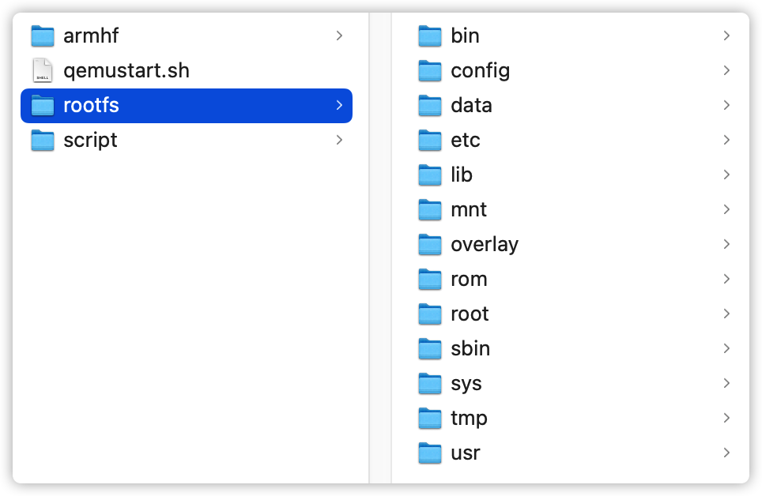
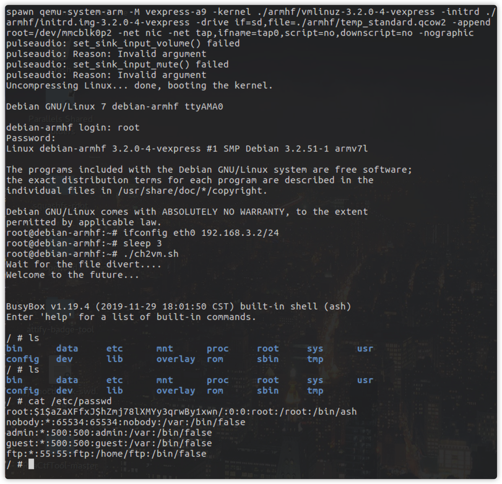

# qemustart
One command to boot the QEMU system

# Getting Started

These instructions will get you a copy of the project up and running on your local machine for development and testing purposes. See deployment for notes on how to deploy the project on a live system.

## Prerequisites:

You need to have Ubuntu16 running in your computer, please install them in the download page.

## Installing all requisites:

To install all commands in Ubuntu 16.04 

```
> sudo apt-get update
> sudo apt-get install qemu-system-mips
> sudo apt-get install qemu-system-arm
> sudo apt-get install qemu-user-static
> sudo apt-get install qemu-utils
> sudo apt-get install expect
> sudo apt-get install uml-utilities
> sudo apt-get install gnome-terminal
```

# Usage

To run the script, you need to copy the equipment file system to the rootfs folder, like flowing picture:

<div align="center">
	
</div>

# Examples

Here are some commands to see how the tool works.

```
> qemustart.sh armel squeeze

> qemustart.sh armel wheezy
 
> qemustart.sh armhf wheezy

> qemustart.sh mips squeeze 32

> qemustart.sh mips squeeze 64

> qemustart.sh mips wheezy 32

> qemustart.sh mips wheezy 64

> qemustart.sh mipsel squeeze 32

> qemustart.sh mipsel squeeze 64

> qemustart.sh mipsel wheezy 32

> qemustart.sh mipsel wheezy 64
```

<div align="center">
	
</div>

The ip adress of virtual machine is 192.168.3.2

# Others

If you want to distinguish the structure of the device, you can use these commands:

```
> file ./rootfs/bin/busybox

> checksec ./rootfs/bin/busybox
```

# Authors

Hope you enjoy it.
